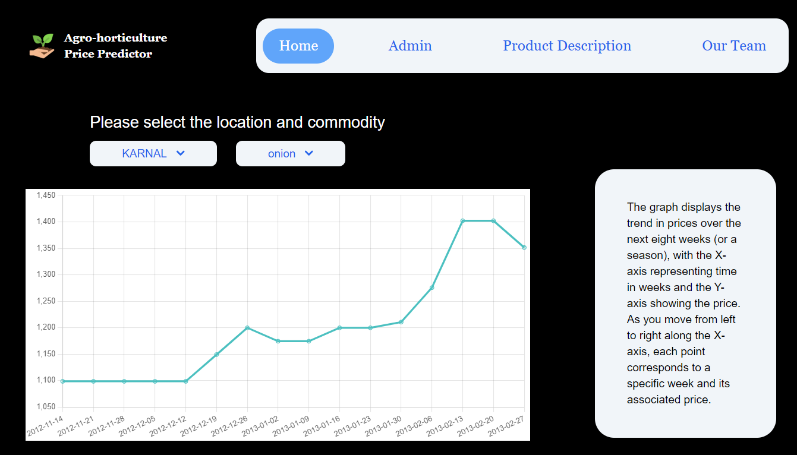
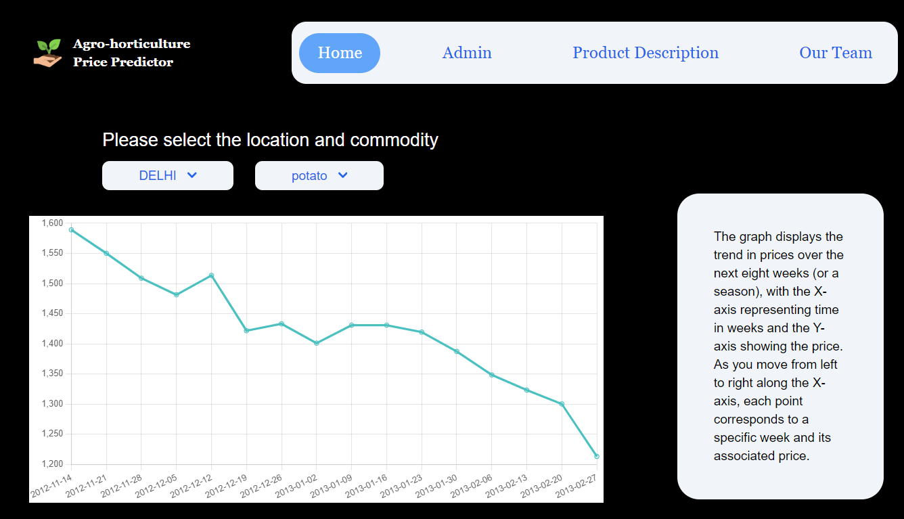

# **Commodity Price Prediction Model**

## **Overview**

This project aims to create a prediction model for commodity prices in India. The model accounts for various factors that result in price changes, allowing the Indian government to decide whether to release their buffer stock to control price volatility. This helps in stabilizing the market and ensuring fair prices for consumers and producers.

## **Problem Statement**

The goal is to predict the prices of different commodities for the next 4 months, based on various factors influencing these prices. The predictions are made on a weekly basis. The government uses these predictions to decide whether to release buffer stock, thereby controlling price volatility. Each government center is responsible for providing weekly price feedback, which is used to continually update and retrain the prediction model.

## **Solution**

We have implemented a solution using the Cronos model to predict commodity prices for the next 4 months on a weekly basis. The model is retrained every week to incorporate new weekly prices provided by various government centers. This ensures that the model remains accurate and reflects the latest market trends.

### **Key Features**

- **Prediction Model**: Uses the Cronos model to predict weekly prices for various commodities over the next 4 months.
- **Data Input and Update**: Government centers input weekly prices via an admin page on the website, which are then appended to the existing dataset.
- **Automated Retraining**: The model is automatically retrained every week with the updated data to maintain accuracy.
- **Endpoints**: Two main endpoints are provided:
  - **Training Endpoint**: For retraining the model with the latest data.
  - **Data Fetching Endpoint**: For fetching predicted and historical price data.
- **Web Interface**: Built using the MERN stack (MongoDB, Express.js, React, Node.js) and displays data using the Chart.js library.

## **Tech Stack**

- **Frontend**: React with Chart.js
- **Backend**: Node.js and Express.js
- **Database**: MongoDB
- **Prediction Model**: Cronos model

## Screenshots

